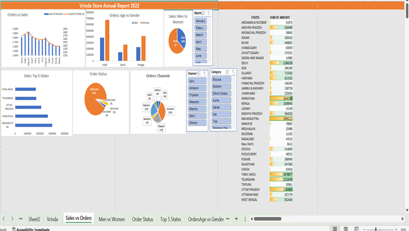

# 📊 Vrinda Store Annual Report 2022 - Excel Dashboard

This project is a comprehensive Excel-based dashboard that visualizes the annual sales performance of **Vrinda Store** for the year 2022. It is designed to provide insightful analytics across different sales dimensions including geography, gender, channels, and more.

---

## 🔍 Features

- 📈 **Orders vs Sales**: Displays monthly trend lines comparing the number of orders with total sales.
- 👨‍👩‍👧 **Sales by Gender & Age**: Visual breakdown of customer demographics based on gender and age groups.
- 🍰 **Top 5 States by Sales**: Horizontal bar chart showcasing the top-performing states.
- 📦 **Order Status Overview**: Pie chart showing different order statuses (Completed, Pending, Returned, etc.).
- 🛒 **Order Channels**: Identifies which platforms (e.g., Amazon, Flipkart, Myntra) customers used most frequently.
- 🌐 **Interactive Filters**: Slicers to dynamically filter by:
  - Month
  - Channel
  - Product Category
  - Gender
  - State

---

## 📁 Project Structure

---

## 💡 Tools Used

- Microsoft Excel
- Pivot Tables
- Pivot Charts
- Slicers & Filters
- Data Visualization Techniques

---

## 🚀 How to Use

1. **Download the Excel File (if available)**: Get the `.xlsx` file from the repository.
2. **Open in Microsoft Excel**.
3. Interact with the slicers to filter data and gain deeper insights.
4. Customize the dashboard further to suit your needs.

---

## 📌 Use Cases

- Business performance analysis
- Sales team presentations
- Monthly/Quarterly executive reports
- Training and skill-building in data visualization with Excel

---

## 📬 Contact

For any queries, feedback, or collaboration ideas, feel free to open an issue or reach out via GitHub.

---

## ⭐️ If you like this project, please consider giving it a star! ⭐️
